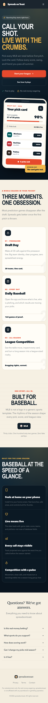

# Spreads on Toast

Spreads on Toast is an MLB-first season prediction game and daily baseball companion. Participants
join private groups, make over/under picks against snapshotted preseason win-total lines, and follow
standings throughout the season. The application also serves two production digital signs through
a stable compatibility API.

The web application is an installable Progressive Web App. Mutations remain network-only and
server-authoritative; the offline experience never claims that a pick was saved without server
confirmation.

## The new Spreads

Spreads on Toast is designed as three connected baseball moments: an exciting preseason pick card,
a fast daily scores companion, and a league competition that stays interesting all summer. The
mobile-first experience uses persistent thumb navigation, system-aware dark mode, safe areas, and a
distinctive night-game/scorebook visual system.


<p align="center">
  
</p>

Brand and product rationale live in [BRAND.md](./BRAND.md),
[DESIGN_SYSTEM.md](./DESIGN_SYSTEM.md), and [DESIGN_DECISIONS.md](./DESIGN_DECISIONS.md).

## Stack

- Next.js 16 App Router, React 19, and TypeScript 5.9
- MongoDB Atlas and Mongoose 9
- Kinde authentication
- Tailwind CSS 4 and Radix UI
- Vitest
- Vercel hosting and cron
- A first-party service worker with no PWA runtime dependency

See [ARCHITECTURE.md](./ARCHITECTURE.md), [TECHNICAL_AUDIT.md](./TECHNICAL_AUDIT.md),
[PWA.md](./PWA.md), [SIGN_API_CONTRACT.md](./SIGN_API_CONTRACT.md), and
[DECISIONS.md](./DECISIONS.md) before changing critical flows.

## Prerequisites

- Node.js 20 or newer
- pnpm 9
- A MongoDB replica-set deployment such as MongoDB Atlas
- A Kinde application

## Environment

Copy `.env.example` to `.env.local` and replace every placeholder.

| Variable                                 | Required          | Purpose                        |
| ---------------------------------------- | ----------------- | ------------------------------ |
| `MONGO_URI`                              | yes               | MongoDB connection URL         |
| `MONGO_USER`, `MONGO_PASSWORD`           | when not embedded | MongoDB credentials            |
| `KINDE_CLIENT_ID`, `KINDE_CLIENT_SECRET` | yes               | Kinde application              |
| `KINDE_ISSUER_URL`                       | yes               | JWT issuer and JWKS host       |
| `KINDE_AUDIENCE`                         | recommended       | Expected bearer-token audience |
| `KINDE_SITE_URL`                         | yes               | Canonical application URL      |
| `KINDE_POST_LOGIN_REDIRECT_URL`          | yes               | Login destination              |
| `KINDE_POST_LOGOUT_REDIRECT_URL`         | yes               | Logout destination             |
| `EXTERNAL_API_KEY`                       | production signs  | Shared sign API key            |
| `CRON_SECRET`                            | production jobs   | Vercel Cron bearer secret      |

Never commit `.env.local`. Rotate `EXTERNAL_API_KEY`, `CRON_SECRET`, and Kinde credentials through
their control planes. A sign-key rotation currently requires coordinated hardware configuration.

## Local development

```bash
pnpm install
pnpm dev
```

Open `http://localhost:3000`. Add these Kinde URLs:

- callback: `http://localhost:3000/api/auth/kinde_callback`
- logout redirect: `http://localhost:3000`

The service worker registers only in production on a secure context. This prevents development
caches from masking changes.

## Database and seed data

The application creates indexes through Mongoose schemas. Run the season seed scripts only against
the intended database:

```bash
npx tsx --env-file=.env.local scripts/seed-2026-mlb.ts
```

Available repair/backfill scripts are in `scripts/`. They are operational tools, not application
startup hooks.

### Sheet snapshot migration

Back up the database, deploy schema-compatible code, and run:

```bash
npx tsx --env-file=.env.local scripts/backfill-sheet-snapshots.ts
```

The migration is repeatable. It copies each group deadline to `Sheet.lockAt` and each configured
season line to `teamPicks[].line`. It refuses to update a sheet when a group or line is missing and
exits non-zero with record IDs. Validate that `updated + skipped` matches the candidate count and
that `errors` is empty. Rollback is to restore the backup; do not remove snapshots after new picks
have been saved because they are historical game data.

## MLB refresh jobs

Vercel schedules the routes in `vercel.json`:

- `/api/cron/sync-standings` daily
- `/api/cron/sync-schedule` daily
- `/api/cron/sync-live` every five minutes during configured UTC game windows

All require `Authorization: Bearer $CRON_SECRET`. The full schedule refresh uses one season request,
normalizes the response, and bulk writes games. Live refresh is deliberately smaller.

To invoke a job manually:

```bash
curl -H "Authorization: Bearer $CRON_SECRET" \
  http://localhost:3000/api/cron/sync-standings
```

Do not put secrets in shell history in shared environments.

## Validation

```bash
pnpm type-check
pnpm lint
pnpm test
pnpm test:contract
pnpm test:pwa
pnpm build
pnpm check:all
```

Tests are colocated with their modules. Sign route tests are compatibility tests, pick/scoring tests
exercise domain rules, and `pwa-assets.test.ts` verifies install assets and cache boundaries.

## PWA testing

Create and run a production build:

```bash
pnpm build
pnpm start
```

Use browser Application tooling to inspect `/site.webmanifest`, the `/sw.js` scope, maskable icons,
offline fallback, and the waiting-worker update flow. Detailed platform steps and limitations are
in [PWA.md](./PWA.md).

## Digital-sign API testing

The external routes require both headers:

```bash
curl \
  -H "X-Api-Key: $EXTERNAL_API_KEY" \
  -H "X-Sign-Id: SIGN_UUID" \
  http://localhost:3000/api/external/sign/config
```

Run `pnpm test:contract` before any sign-related deployment. The frozen schemas, ordering, errors,
and empty-state behavior are documented in [SIGN_API_CONTRACT.md](./SIGN_API_CONTRACT.md).

## Production build and deployment

1. Back up MongoDB and confirm restore access.
2. Run `pnpm check:all`.
3. Deploy to a preview environment with production-equivalent variables.
4. Run the sheet snapshot migration when upgrading legacy data.
5. Verify `/api/health`, Kinde login/logout, pick save/lock behavior, both sign endpoints, and the
   scheduled jobs.
6. Deploy to Vercel.
7. Confirm both physical signs continue polling successfully.

`GET /api/health` is a non-cached liveness check. Database readiness, alerting, and backup policy
remain infrastructure responsibilities and are called out in the audit.

## Troubleshooting

- `Missing MONGO_URI`: confirm `.env.local` is present and the command loads it.
- MongoDB selection timeout: check Atlas network access and credentials.
- Missing teams or lines on a sheet: run the snapshot migration and inspect its exact record error.
- Stale installed app: use “Reset offline data” on the offline screen or follow [PWA.md](./PWA.md).
- Sign `401`: confirm both header names and coordinate key rotation with the hardware.
- Cron `401`: confirm Vercel and the application share the same `CRON_SECRET`.
